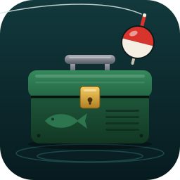

# Angler's TackleBox

One-key fishing for World of Warcraft that remembers what you caught. For Retail (Midnight 12.1) and WoW Forever (the `_Camelot` client, interface 16001). The full design is in `Tacklebox — WoW Fishing Addon Design.md`.

## How it works

You pick one key. While fishing mode is on, each press of that key does the next right thing: equip the pole (Classic), start the raft, apply a lure, cast, or reel in. The addon only decides what the key does next; your keypress does the action. With fishing mode off the addon is inert: no events, no timers, no bindings, no CVar changes. Even with it on, sound and interact settings only change from your first cast until 30 seconds after you stop, so the mode is safe to leave on all day.

## Install for testing

Symlink the repo into the game's AddOns folder, then `/reload`:

    ln -s "$PWD" "/Applications/World of Warcraft/_retail_/Interface/AddOns/Angler's TackleBox"

## Use

1. `/tb bind` and press the key you want to fish with.
2. `/tb` to turn fishing mode on. It is also in the addon compartment and under Options > Keybindings > AddOns.
3. Press your key to cast, and again when the bobber splashes.

| Command | What it does |
| --- | --- |
| `/tb` | Toggle fishing mode |
| `/tb menu` | Open the Angler's TackleBox window (also: left-click the addon compartment icon) |
| `/tb always [on\|off]` | Keep fishing mode on all the time; `/tb` still pauses it |
| `/tb bind`, `/tb key F`, `/tb key none` | Pick, set or clear the fishing key |
| `/tb lure <link or ID>`, `/tb lure auto`, `/tb lure off` | Choose the lure to keep up |
| `/tb extra <link or ID>` | Add or remove a toy or item to keep up (bobber toys, tea) |
| `/tb raft [on\|off]` | Use the fishing raft |
| `/tb oversized [on\|off]` | Keep the Reusable Oversized Bobber up |
| `/tb bobber [random\|off\|link or ID]` | Bobber toy to keep up; no argument opens the list |
| `/tb doubleclick [on\|off]` | A quick double right-click does the same as the key |
| `/tb set <name>`, `/tb set none` | Equipment set to wear while fishing |
| `/tb hud` | Show or hide the Fishing Companion (the small window while you fish) |
| `/tb tabs` | Choose and order the fishing companion's tabs, in the Top Tray (Session always stays first) |
| `/tb log` | Catch log, By zone view: per-zone catches, share, value and pools |
| `/tb journal` | Catch log, By fish view: a page per fish with where you catch it |
| `/tb export` | The catch log as CSV in a copyable box |
| `/tb export settings`, `/tb import [string]` | Copy your settings out as a string, or paste one back in |
| `/tb sound [name\|test] [kind]` | Choose the alert sound, for all alerts or one kind; `cast`, `catch` or `miss` as the kind sets a fishing cue |
| `/tb casts [reset]` | List the extra fishing casts TackleBox learned (like fishing into an Oceanic Vortex), or forget them |
| `/tb sessions [drop N\|clear]` | List or remove saved sessions |
| `/tb forget spot` | Forget the fishing spot you are standing on |
| `/tb welcome` | Reopen the first-run welcome |
| `/tb stats`, `/tb reset` | Print or restart session stats |
| `/tb find <fish>` | Where you catch it, from your own log (no argument opens the catch log By fish view) |
| `/tb gold` | Best zones and spots by gold per hour |
| `/tb scan` | Refresh fish prices through Auctionator (only works with the auction house open) |
| `/tb records`, `/tb share [party\|guild\|say]` | Personal records; post this session to chat |
| `/tb camera save\|on\|off` | Fishing camera zoom preset |
| `/tb pins`, `/tb minimap` | Toggle world map pins and the minimap button |
| `/tb events` | Countdowns to the fishing contests (realm time) |
| `/tb goals` | Progress on unfinished fishing achievements |
| `/tb midnight` | Captain Tokka's Crew reputation and Coiled Filament toward the mount (also on the Events tab) |
| `/tb options` | Open the settings panel |
| `/tb shopdebug` | With Cooking open: report each step of the Shopping scan, for bug reports |

## Leaving the gold module out of a release

Everything gold-related (rankings, value alert, sell helper, history chart) lives in `Gold.lua`, and nothing else depends on it. To keep it private, remove `Gold.lua` from both TOC files and add it to `ignore:` in `.pkgmeta`. The Gold compartment and `/tb gold` disappear by themselves.

## Development

    luacheck .
    lua tests/smoke.lua
    TB_FLAVOR=classic lua tests/smoke.lua

`tests/smoke.lua` stubs the WoW API and drives a fishing session through every module; `TB_FLAVOR=classic` runs the WoW Forever configuration (pole, enchant lures, mouseover reel) instead. It checks the wiring, not the game: in-game testing is still needed for anything the stubs assume.

## Credits

The Briny Best tracker builds on [BrinyBest](https://github.com/nerolabs/BrinyBest) by Andrew Edmond: its way of reading the Fishing Journal, fish IDs, each language's journal labels, the Coiled Isle zone-name fixes and rank cutoffs. BrinyBest is MIT licensed; its license ships in `Licenses/BrinyBest.txt`.

## License

All rights reserved. You may install and use the addon and read its source; redistributing it, publishing forks, or reusing its code needs permission. See `LICENSE`.
