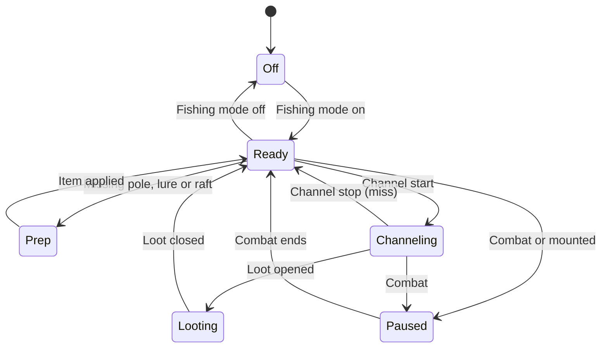

# Tacklebox — WoW Fishing Addon Design

2026-09-19 · @Someone

## Summary

Tacklebox is a one-key fishing addon for Retail (Midnight 12.1) and the Classic flavors that also remembers what you caught. It combines Angleur-style one-button casting with the catch log and session stats that Fishing Buddy used to provide. Fishing Buddy has not been updated since December 2024, and no maintained Retail addon does both.

**Who it's for:** anyone farming Midnight pools or grinding the Coiled Isle Tokka reputation. It is also for collectors chasing mounts and achievements such as Nether-Swept Drake, Sea Turtle, Salty and The Derby Dash.

**Design principles**

1. **One key, one action, always legal.** Every protected action comes from one real keypress. The addon only decides what that key does next.
2. **Inert outside fishing.** When fishing mode is off, Tacklebox does no OnUpdate work, holds no override bindings and changes no CVars. This avoids the Mythic+ taint that hit Angleur (issue #40).
3. **Fast first, features second.** Recast speed must match Better Fishing, the complaint that keeps users from switching (Angleur #24).
4. **Restore everything.** Every CVar, binding and gear change the addon makes is undone on exit, on combat and on logout.
5. **One codebase, several flavors.** A small compatibility layer hides the API differences between Retail and Classic.
6. **Original code.** Angleur is All Rights Reserved, so we study how it works and write our own. The MIT-licensed addons (Interactive Fishing Bobber, Fishing Mode, BrinyBest) are fine to borrow from, with attribution.

## Fishing in WoW today

Live Retail is **12.1 "Curse of Ula'tek"**, released Aug 11, 2026; 12.1.5 is on the PTR. Fishing is still the same loop: cast, wait up to \~21 s for the bobber to splash, interact within a short window. Everything the addon adds sits around that loop.

### Core mechanics

- **Skill is split by expansion.** Midnight fishing runs 1–300 (same size as The War Within). Open water carries you to \~125; pools are needed for 125–300. Fishing has **no specializations or knowledge tree** in Midnight.
- **Zone gates (min / recommended):** Eversong 1/1, Zul'Aman 75/100, Harandar 100/225, Voidstorm 225/300. Guides differ slightly on these numbers.
- **Stats:** Finesse raises bulk yield. Perception is meant to raise rare catches, but players dispute whether it works.
- **Gear:** a rod (Engineering: Farstrider Hobbyist, Sin'dorei Angler's, Sin'dorei Reeler's), a hat (Tailoring: Elegant Artisan's Fishing Hat), and the Midnight Angler's Grand Line, which doubles treasure drops.
- **Lures are now crafted by Fishing itself** and last 30 minutes each: Lucky Loa, Blood Hunter, Ominous Octopus, Sunwell Fish, and the Amani Angler's Ward.
- **Find Fish** (taught by the Angler's Guide) tracks pools on the minimap.

### Midnight catches worth special handling

| Catch or event | Why the addon cares |
| --- | --- |
| Blood Hunter | Spawns a hostile spirit. Warn the player and pause, because combat will lock the key. |
| Warping Wise | Teleports you to a random Midnight zone. Warn before looting, and track it in the log. |
| Null Voidfish, Ominous Octopus | Rare fish. Show a highlight alert. |
| Patient Treasure | Chests that spawn at random while fishing. Show an alert. |
| Careless Cargo, Lost Treasures pools | Treasure pools that drop An Angler's Deep Dive (+10 skill). |
| Nether-Warped Egg | Hatches into the Nether-Swept Drake mount. Big celebratory alert. |

### 12.1 Coiled Isle: the new fishing system

- **Captain Tokka's Crew** friendship reputation. Rep comes from dailies at Tokka's Folly, Open Sea Fishing, and killing **Master Grenadier Birdie** when it spawns while you fish (+50).
- **Cursed Surges** rotate every 30–45 minutes among five sites, e.g. The Broodmother's Nest and The Malformed Leviathan. Defeating one opens Cursed Fishing nodes there for up to 30 minutes. The weekly quest "Turn Back the Surge" asks for 3.
- **Venom Fishing** and **Temple Fishing** (in the Vaults of Atal'Utek) unlock through the storyline.
- **The Coiled Huntress** rod gives water breathing and swim speed on the isle, and builds Venom stacks that you turn into Coiled Filament. The **Sea-Dwelling Isle Serpent** mount costs 2,500 Filament.
- There are 14 new fish, e.g. Ula'tek Snakehead and Coiled Stargorger, and new lures: Ula'tek Snakehead Lure, Coiled Stargorger Lure, Eerie Lure and Tokka's Multi-Ward.

### Carry-over and evergreen goals

- **Hallowfall Fishing Derby** (The War Within) runs every Saturday for 24 hours. Accepting it gives the 1-hour Derby Dasher buff; catch 3 trophy fish. **The Derby Dash** achievement awards the Kah, Legend of the Deep mount.
- **Stranglethorn Fishing Extravaganza** runs Sundays 2–4 pm: be first to turn in 40 Speckled Tastyfish. The Kalu'ak derby was removed in 5.1.
- **Salty** title from Accomplished Angler: 1000 fish, Fishing Diplomat (Old Crafty, Old Ironjaw), Limnologist, Oceanographer, and more.
- **Sea Turtle** mount: about 0.2% from Northrend pools or a garrison Fishing Shack; never from open water.
- **Classic-era time and season gates** still apply: Nightfin Snapper (6 pm–midnight), Sunscale Salmon (6 am–noon), Winter Squid and Summer Bass.
- **Commonly used toys and tools:** Angler's Fishing Raft, the Crate of Bobbers series, Nat's Fishing Chair, and the Underlight Angler (Legion artifact; its pool teleport works only on Legion pools).

## Existing addons and the gap

Angleur is the right model for the one-key engine, but on Retail nobody pairs a fast one-key engine with catch stats and Midnight-specific helpers. That combination is the gap Tacklebox fills.

### How Angleur works (the "good start")

Angleur 2.9.616 (Sept 7, 2026, by Legolando) supports Retail 12.1 and the Classic flavors. It is All Rights Reserved, so we learn from its approach but write our own code.

- **One rebinding key.** Angleur never clicks the bobber for you. An OnUpdate loop keeps re-pointing your chosen key at the next correct action:
  - dead: clear the key
  - channeling: reel in (`INTERACTTARGET`)
  - mounted: clear the key
  - otherwise, the first that applies: raft, then oversized bobber, then crate bobber, then extra toys, then extra items, then cast
- **Soft Interact does the reeling.** When the channel starts, it temporarily raises the soft-target interact CVars so the interact key grabs the bobber. It restores them afterwards.
- **Safety rules:** it never rebinds while the key is held (this caused a "raft jump" bug), and it clears everything in combat.
- **Midnight handling:** it guards event payloads with `issecretvalue()`. Its loop still ran outside fishing and compared a secret cooldown in Mythic+, which caused taint (issue #40).
- **Other features:** auto-equip profiles, lures and bait, raft refresh under 60 s, crate and clam opening, "Ultra Focus" sound mode, sleep toggle, and a Classic-only camera "Bobber Scanner".

### The field

| Addon | Retail 12.1? | What it does | Gap |
| --- | --- | --- | --- |
| [Better Fishing](https://www.curseforge.com/wow/addons/better-fishing) | Yes (Sep 2026) | Fastest one-key or double-click via soft-target; 5.6M downloads | No stats, gear or lures |
| [Angleur](https://www.curseforge.com/wow/addons/angleur) | Yes (Sep 2026) | Full one-key suite with toys, gear and sound | Slower recast; taint outside fishing; no catch log |
| [Fishing Buddy](https://www.curseforge.com/wow/addons/fishingbuddy) | No (Dec 2024) | Historic all-in-one: catch stats per zone, outfits, alerts | Unmaintained |
| [Fishing Mode](https://www.curseforge.com/wow/addons/fishing-mode) | 12.0.1 (MIT) | Toggle mode with an overlay of controls | Small feature set |
| [Interactive Fishing Bobber](https://github.com/Smef/InteractiveFishingBobber) | 12.0.0 (MIT) | Only sets the soft-interact CVars during the cast | Minimal by design |
| [MidnightFishCounter](https://www.curseforge.com/wow/addons/midnightfishcounter) | Yes | Session catches, drop %, gold/hour | No casting |
| [BrinyBest](https://www.curseforge.com/wow/addons/brinybest) | Yes (MIT) | Tracker for "The Briny Best" achievement | Single purpose |
| [FishingKit](https://www.curseforge.com/wow/addons/fishingkit-classic) | Classic only | Richest feature set: timers, routes, bite analysis | No Retail version |

### Requested but missing

- Faster recast after a catch or a miss (Angleur #24).
- A queue or alert when lures run out (Angleur #35).
- An audio or visual bite cue beyond just making the splash louder (Angleur #41).
- Gold per hour and catch stats in the same addon that does the casting.
- Helpers for Midnight systems: Cursed Surge timers, Tokka rep, Derby Dasher timer.

## Rules of the road

The addon may decide *what the next keypress does*. It may never *press the key itself*. Every feature below is designed around that line.

### Why: protected actions

WoW marks some functions as **protected**: casting, using items or toys, interacting, targeting and movement. Addon code ("tainted" code) can only trigger them through Blizzard's **secure** templates, and only in response to a real hardware event: a key or mouse press. One press means one protected action. Blizzard's stated intent is that addons can cast "with user interaction" but cannot "use logic to intelligently pick spells or targets" in combat.

Outside combat, an addon *may* change what a key is bound to (`SetOverrideBinding*`) and change the attributes of a secure button. That is the loophole every one-key fishing addon uses. The addon rebinds between presses, and the player's press does the action. Nothing is automated.

| Allowed | Not allowed |
| --- | --- |
| Rebind one key between presses: cast, reel, lure, raft | Casting or reeling from a timer, OnUpdate or an event handler |
| Changing CVars: soft-interact range, sound volumes, auto-loot | Clicking the bobber automatically when it splashes |
| Equipping gear out of combat | Any rebinding or secure change during `InCombatLockdown()` |
| Alerts, sounds, logs, timers, UI | External tools that send input (AutoHotkey loops, pixel bots). These break the EULA and get accounts banned. |

### Midnight 12.x "secret values"

In 12.0 Blizzard made some API results **secret**: opaque values that addon code can pass along but cannot compare, do math on, or branch on. Secrets apply in combat, in boss encounters, during Mythic+ runs and in PvP. Inside instances, creature names, GUIDs and chat can also be secret.

- **Impact on fishing is small.** The player's own casts and profession spells are explicitly non-secret, and fishing happens out of combat in the open world.
- **The trap is running code where you don't need to.** Angleur's taint came from an always-on loop reading a secret cooldown in Mythic+. Tacklebox's rule: register no OnUpdate and no combat events unless fishing mode is on. Wrap anything that might be secret in `issecretvalue()` checks.
- **Unverified for 12.x:** whether `CHAT_MSG_LOOT` arrives as secret inside instances. The catch log uses `LOOT_OPENED` plus `GetLootSlotLink()` instead.

### Addon policy basics

Blizzard's UI Add-On Development Policy requires addons to be free, unobfuscated, free of ads and donation begging inside the game, and light on server load. Tacklebox meets all of these by default.

## Feature design

Tacklebox is built as separate modules around one core. v1.0 ships the one-key engine, audio, gear, lures, the catch log and alerts. Midnight helpers and collection tracking follow.

| Module | What it does | Phase | Flavors |
| --- | --- | --- | --- |
| **Core: Fishing Mode** | A toggle (key, slash command or compartment click) that turns everything on or off. With it off, the addon is inert. Optional auto-on when a pole is equipped or you are standing near a known pool. | MVP | All |
| **One-Key Engine** | One user key does the right thing each press: equip pole, apply lure, refresh raft or bobber toy, cast, or reel. Optional double-right-click mode for mouse users. | MVP | All |
| **Snappy Recast** | Re-arms the key the instant the channel ends: after a catch, a miss, or an out-of-range cast. Aim: the next press always casts. | MVP | All |
| **Focus Audio** | While fishing, raises SFX, mutes music and ambience, keeps sound on when the game is in the background, then restores your originals. The game fires no event for the splash, so the splash sound is the bite cue. A separate visual cue is an open question. | MVP | All |
| **Gear Swap** | Swaps in your fishing rod, hat and line when fishing mode starts, and puts your normal gear back when it ends. Uses an equipment set if you have one. Never runs in combat. | MVP | All (Classic has no line slot) |
| **Lure & Buff Manager** | Picks the lure for the fish you are after, warns 60 s before it expires, and puts "apply lure" into the one-key queue. Covers tea, phials and rafts too. | MVP | All (item lists per flavor) |
| **Catch Log** | Records every catch by zone, subzone, pool and time, with a session HUD: casts, catches, catch rate, gold/hour, and a streak since the last rare. | MVP | All |
| **Alerts** | Screen and sound alerts for rares, mount eggs, treasure pools, Patient Treasure, Blood Hunter spirits and Master Grenadier Birdie. Warns before a Warping Wise teleport. | v1.1 | Retail |
| **Midnight Helpers** | Cursed Surge rotation timer and the 30-minute node window, Tokka rep progress, Coiled Filament and Venom stacks, Derby Dasher countdown. | v1.2 | Retail |
| **Collections Tracker** | Progress toward fishing mounts, pets and achievements: Salty, The Derby Dash, Limnologist, The Briny Best, Sea Turtle attempts (in the style of Rarity). | v1.3 | All |
| **Events Clock** | Countdowns to the Stranglethorn Extravaganza (Sun 2 pm), the Hallowfall Derby (Sat), and Classic time-of-day fish windows. | v1.3 | All |
| **Bobber Finder** | Fallback when soft-interact misses: a marker or glow on the bobber, plus a camera-scan option on Classic. | Later | Classic first |

### Key interactions

- **One-key priority order**, highest first:
  1. In combat or dead: do nothing and release the key.
  2. Channeling: reel in (interact).
  3. No pole equipped: equip the pole.
  4. Raft needed (standing in water, raft under 60 s): use the raft toy.
  5. Lure missing: apply the chosen lure.
  6. Queued extras: bobber toy, tea, phial.
  7. Otherwise: cast Fishing.
- **Settings** live in Blizzard's built-in Settings panel, with an Addon Compartment entry. No minimap button unless the player turns one on through LibDBIcon.
- **Keybind UX:** the player picks one key in settings. The addon holds it only while fishing mode is on, so the key goes back to its normal job otherwise.
- **Accessibility:** the bite cue can be a screen flash as well as a sound, the HUD can be scaled, and every alert can be turned off.

## Technical architecture

Tacklebox is a plain Lua addon with no required libraries. Its center is a small state machine: every change of state picks one action and rebinds the fishing key to it. Nothing polls in a loop.

### State machine



Each arrow is triggered by a game event, not a timer. When the state changes, `Engine:Rearm()` works out the next action and points the key at it. The only exception is Paused: in combat, bindings cannot change, so the addon clears them before combat (on `PLAYER_REGEN_DISABLED`) and re-arms after it.

### How the one key works

The addon owns one hidden secure button. "Arming" means setting that button's attributes and pointing the player's key at it, or pointing the key straight at the interact action while channeling.

```lua
-- One hidden secure button does every protected action.
local btn = CreateFrame("Button", "TackleboxActionButton", UIParent, "SecureActionButtonTemplate")
btn:RegisterForClicks("AnyUp", "AnyDown")   -- works whichever key-down setting the player uses

function Engine:Rearm()
  if InCombatLockdown() then self.pending = true return end   -- can't touch bindings in combat
  local key = DB.key
  if IsKeyDown(key) then C_Timer.After(0.05, function() self:Rearm() end) return end  -- never rebind mid-press

  if self.state == "CHANNELING" then
    SetOverrideBinding(owner, true, key, Compat.INTERACT)   -- next press reels in
    return
  end

  local action = Planner:Next()   -- { type="item"|"toy"|"spell", value=... }
  btn:SetAttribute("type", action.type)
  btn:SetAttribute(action.type, action.value)
  SetOverrideBindingClick(owner, true, key, "TackleboxActionButton")  -- next press does 'action'
end
```

Three details matter here.

- **`SecureActionButtonTemplate`** is Blizzard's template. When the player's real keypress "clicks" it, it can do the protected action stored in its attributes: cast a spell, use a toy or item, or equip an item.
- **`SetOverrideBinding(owner, true, ...)`** puts a temporary binding on top of the player's real keybinds. `ClearOverrideBindings(owner)` removes it cleanly, so their normal bindings are never touched.
- **The `IsKeyDown` guard** re-arms 50 ms later instead of rebinding mid-press. That C\_Timer only rebinds; it never does an action, so it stays within the rules.

### Key APIs by job

| Job | API | Notes |
| --- | --- | --- |
| Detect cast and end | `UNIT_SPELLCAST_CHANNEL_START` / `_STOP`, registered for the player only | Match the spell by ID set {131474, 131476} or by the localized name. Never hardcode "Fishing". |
| Reel in | `INTERACTTARGET` binding plus the `SoftTargetInteract` CVars | Save and restore the CVars. `SoftTargetInteractArc` and `SoftTargetInteractRange` are unverified on 12.x; check them with `C_CVar.GetCVarInfo`. |
| Log catches | `LOOT_OPENED`, `IsFishingLoot()`, `GetLootSlotInfo`, `GetLootSlotLink` | `IsFishingLoot` is not in the 12.x docs; verify it. |
| Where am I | `C_Map.GetBestMapForUnit("player")`, `GetSubZoneText()` | Pool name comes from the soft-interact tooltip or `C_TooltipInfo`. |
| Gear | `C_Item.EquipItemByName`, `C_EquipmentSet.UseEquipmentSet` | Out of combat only. |
| Toys | `PlayerHasToy`, secure button `type=toy` | `C_ToyBox.IsToyUsable` is unreliable after combat. |
| Buffs | `C_UnitAuras.GetPlayerAuraBySpellID`, `GetWeaponEnchantInfo()` | Lures that enchant the pole show up as a weapon enchant. |
| Skill | `GetProfessions()` then `GetProfessionInfo(fish)` | The Midnight child skill-line ID is still to be found. |
| Sound | `Sound_SFXVolume`, `Sound_MusicVolume`, `Sound_AmbienceVolume`, `Sound_EnableSoundWhenGameIsInBG` | Restore on mode off and on `PLAYER_LOGOUT`. |
| Settings | `Settings.RegisterVerticalLayoutCategory`, `Settings.RegisterAddOnSetting` | TOC `## AddonCompartmentFunc` adds the compartment entry. |

### Retail vs Classic

All flavor-specific code lives in one `Compat.lua` file. The rest of the addon calls `Compat.*` and never checks the game version itself.

- **Flavor detection:** `WOW_PROJECT_ID` compared with `WOW_PROJECT_MAINLINE`, `WOW_PROJECT_CLASSIC` and the other flavor constants.
- **Spell info:** `C_Spell.GetSpellInfo` on Retail; the older `GetSpellInfo` where C\_Spell is missing.
- **Fishing spell:** Retail uses 131474. Classic uses rank-based IDs, so resolve the spell by name from the spellbook.
- **Interact:** `INTERACTTARGET` on Retail. Angleur uses `INTERACTMOUSEOVER` on Classic, because soft interact is less reliable there.
- **Data:** item and lure tables split per flavor: `Data/Retail.lua`, `Data/Classic.lua`.
- **TOC files:** one per flavor (`Tacklebox_Mainline.toc`, `Tacklebox_Vanilla.toc`, `Tacklebox_Mists.toc`, ...), each loading the shared files plus its data file. Retail is `## Interface: 120100, 120105`.

### File layout

```
Tacklebox/
  Tacklebox_Mainline.toc   Tacklebox_Vanilla.toc   Tacklebox_Mists.toc
  Core.lua        -- addon table, events, fishing-mode toggle, SavedVariables
  Compat.lua      -- every Retail/Classic difference
  Engine.lua      -- state machine, secure button, key arming
  Planner.lua     -- decides the next action (priority list)
  Audio.lua       -- CVar save/boost/restore
  Gear.lua        -- equip and restore
  Lures.lua       -- lure/buff timers and choices
  Log.lua         -- catch log and session stats
  HUD.lua         -- session window, alerts
  Options.lua     -- Settings panel, slash commands, compartment
  Data/Retail.lua  Data/Classic.lua   -- item, lure, pool and rare IDs
  Locales/enUS.lua ...
  .pkgmeta  .luacheckrc  .github/workflows/release.yml
```

### Saved data

`TackleboxDB` holds account-wide settings. `TackleboxCharDB` holds per-character gear sets and the catch log, keyed as `log[mapID][itemID] = { count, first, last }`, plus per-session summaries. Old sessions roll up into daily totals so the file stays small.

### Tooling

- **VS Code** with the `ketho.wow-api` extension. It gives autocomplete and type hints for the whole WoW API, events and CVars.
- **luacheck** for linting, set to Lua 5.1 with WoW globals declared.
- **BugSack** and BugGrabber in-game to catch errors. Use `/reload`, `/etrace` and `/dump` while testing.
- **BigWigsMods/packager** GitHub Action to publish tagged releases to CurseForge and Wago.
- For taint testing, turn on the `secretAurasForced` CVar to test secret-value behavior outside combat.

## Roadmap

Build the engine on Retail first, prove it is fast and taint-free, then add Classic and the extra modules.

| Milestone | Scope | Done when |
| --- | --- | --- |
| v0.1 Engine spike | Core, Engine, Compat (Retail only), fishing-mode toggle, cast and reel on one key | 100 casts in a row with no missed rebinds; no errors in BugSack |
| v0.2 Comfort | Audio, Gear, Lures, Settings panel | Toggling off restores every CVar, binding and gear piece |
| v0.3 Log | Catch log, session HUD, gold/hour | Stats match a manual count over one session |
| v0.4 Classic | Classic data files and TOCs, spellbook lookup, `INTERACTMOUSEOVER` | Same v0.1 test passes on Classic Era and Mists Classic |
| v1.0 Release | Localization hooks, packager pipeline, CurseForge and Wago listing | A clean install works on every flavor |
| v1.1 – v1.3 | Alerts, Midnight Helpers, Collections, Events Clock | Driven by player feedback |

## Open questions

- [ ] Name: is "Tacklebox" free on CurseForge and Wago?
- [ ] Do `SoftTargetInteractArc` and `SoftTargetInteractRange` still exist on 12.1? Check in-game with `/dump C_CVar.GetCVarInfo("SoftTargetInteractRange")`.
- [ ] Which spell ID does the channel event report on 12.1: 131474 or 131476?
- [ ] Does `IsFishingLoot()` still exist on 12.1 and on each Classic flavor?
- [ ] What is the Midnight fishing skill-line ID, needed for the skill display?
- [ ] Is there any usable bite signal besides the sound, for a visual cue?
- [ ] What does the Coiled Huntress cost? Wowhead pages disagree: 0, 500 or 6,000 Voidlight Marl.
- [ ] Should Tacklebox offer an optional Angleur-style camera scan on Retail, or keep it Classic-only?

## Sources

- Game state and fishing content: [Icy Veins, 12.1 live](https://www.icy-veins.com/wow/news/patch-12-1-curse-of-ulatek-is-now-live-patch-notes-survival-guide/), [warcraft.wiki.gg: Fishing](https://warcraft.wiki.gg/wiki/Fishing), [Wowhead Midnight fishing overview](https://www.wowhead.com/guide/midnight/professions/fishing-overview-trainer-locations-pools-tools), [Wowhead Cursed Surges and Tokka guide](https://www.wowhead.com/guide/midnight/cursed-surges-fishing-captain-tokka-reputation-patch-12-1), [Icy Veins fishing guide](https://www.icy-veins.com/wow/professions-fishing), [Method Midnight fishing](https://www.method.gg/guides/midnight-fishing-profession-guide), [wow-professions leveling guide](https://www.wow-professions.com/guides/wow-fishing-leveling-guide), [Wowhead Hallowfall Derby](https://www.wowhead.com/guide/the-war-within/professions/the-hallowfall-fishing-derby), [wiki: Stranglethorn Extravaganza](https://warcraft.wiki.gg/wiki/Stranglethorn_Fishing_Extravaganza), [Wowhead: Accomplished Angler](https://www.wowhead.com/achievement=1516/accomplished-angler)
- Addons: [Angleur on CurseForge](https://www.curseforge.com/wow/addons/angleur), [Angleur GitHub and issues](https://github.com/LegolandoBloom/Angleur/issues), [Better Fishing](https://www.curseforge.com/wow/addons/better-fishing), [Fishing Buddy](https://www.curseforge.com/wow/addons/fishingbuddy), [Interactive Fishing Bobber](https://github.com/Smef/InteractiveFishingBobber)
- API and rules: [Patch 12.0.0 API changes](https://warcraft.wiki.gg/wiki/Patch_12.0.0/API_changes), [Patch 12.1.0 API changes](https://warcraft.wiki.gg/wiki/Patch_12.1.0/API_changes), [Blizzard: combat philosophy and addon disarmament](https://news.blizzard.com/en-us/article/24246290/combat-philosophy-and-addon-disarmament-in-midnight), [Secure execution and tainting](https://warcraft.wiki.gg/wiki/Secure_Execution_and_Tainting), [Interact key](https://warcraft.wiki.gg/wiki/Interact_Key), [TOC format](https://warcraft.wiki.gg/wiki/TOC_format), [UI Add-On Development Policy](https://us.forums.blizzard.com/en/wow/t/ui-add-on-development-policy/24534), [BigWigsMods packager](https://github.com/BigWigsMods/packager)
